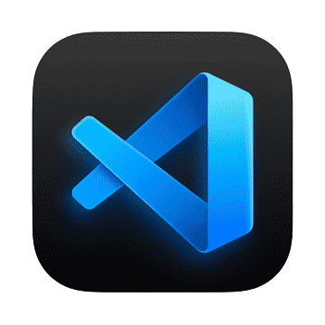
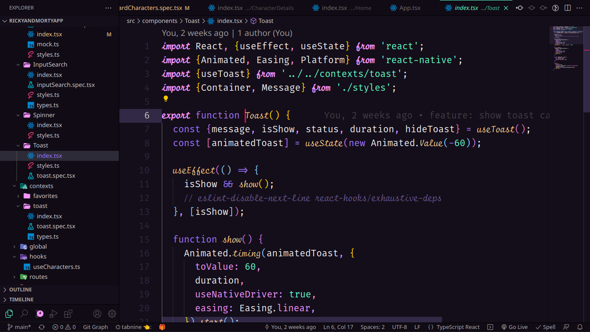

<h1 align="center">
  <br>
  
  <br>
  Aura Dracula Spirit for <a href="https://code.visualstudio.com/">Visual Studio Code</a>
  <br>
</h1>

<p align="center">
  <strong>Dark theme for Visual Studio Code</strong>
</p>

<p align="center">
  

  
</p>

<p align="center">
  <a href="#install">Install</a> •
  <a href="#team">Team</a> •
  <a href="#preferences-shown-in-the-preview">Imitate Preview</a> •
  <a href="#license">License</a>
</p>

<p align="center">
  
</p>

## Install

All instructions can be found at [INSTALL.md](./INSTALL.md).

## Preferences shown in the preview

The font in the preview image is Fira Code IScript, [available here](https://dank.sh/). Editor settings to activate font ligatures:

```
"editor.fontFamily": "'Fira Code iScript'",
"editor.lineHeight": 30,
"editor.fontWeight": "400",
"editor.tabSize": 2,
"editor.fontSize": 20,
```

## Team

This theme is heavily inspired by [Aura Theme from Dalton Menezes](https://github.com/daltonmenezes/aura-theme) and [Dracula from Zeno Rocha](https://github.com/dracula/visual-studio-code).
It is maintained by the following person(s) and a bunch of [awesome contributors](https://github.com/guilhermerodz/aura-spirit-dracula/graphs/contributors).

| [](https://github.com/josemurilloc) |
| ---------------------------------------------------------------------------------------------------- |
| [Jose Murillo](https://github.com/josemurilloc)                                                   |

## Disclaimer

This theme is heavily inspired by [Omni from Rocketseat](https://github.com/getomni/visual-studio-code).
The italics are inspired by [Night Owl from Sarah Drasner](https://github.com/sdras/night-owl-vscode-theme).

## License

[MIT License](./LICENSE.md)
